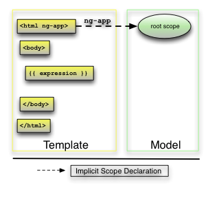
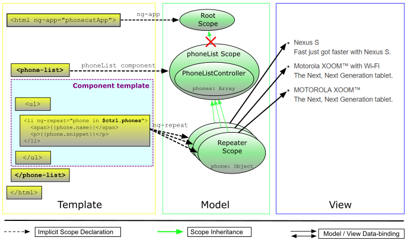
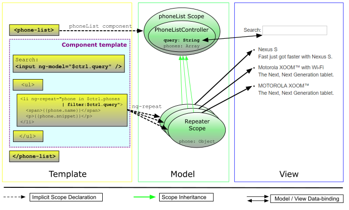
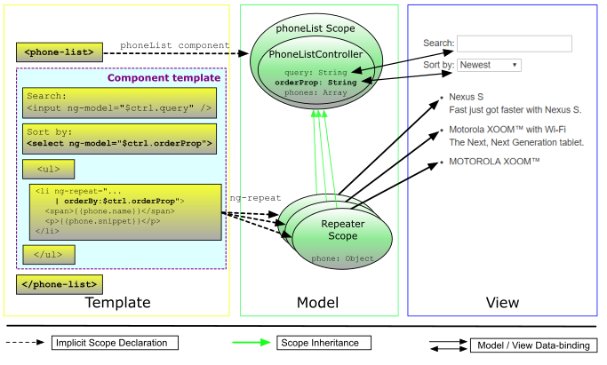
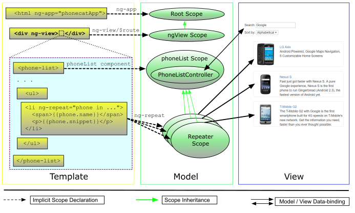
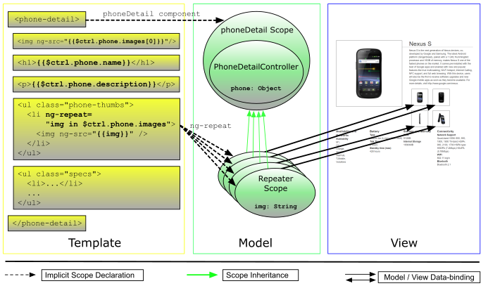
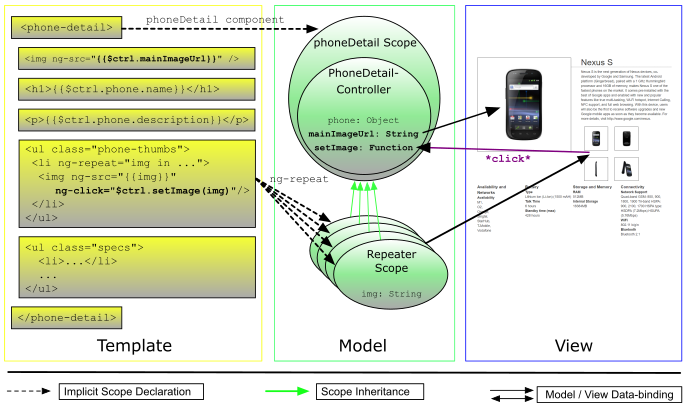

# AngularJS 官方教程

# [0 - Bootstrapping](https://docs.angularjs.org/tutorial/step_00)

## 代码解释

### `ng-app` 属性

```html
<html ng-app>
```

`ng-app` 属性表示 AngularJS 的 `ngApp` 指令（AngularJS 使用 `kebab-case` 表示自定义 HTML 属性，用 `camelCase` 表示对应的实现指令）。

该指令表示 AngularJS 会将该 HTML 元素视为 app 的根元素。

开发者可以自由决定将整个 HTML 页面或只是页面的某部分作为 AngularJS app。

关于 `ngApp`，另见：[API Reference](https://docs.angularjs.org/api/ng/directive/ngApp)

### `angular.js` 脚本标签

```html
<script src="lib/angular/angular.js"></script>
```

该代码下载 `angular.js` 脚本，在包含该脚本的 HTML 页面完全下载完成后会执行脚本中的回调用于初始化 app。

在回调执行时，AngularJS 会查找 [ngApp](https://docs.angularjs.org/api/ng/directive/ngApp)。若找到，AngularJS 会开始初始化 app，并以 `ngApp` 指令所在的元素作为 app 的根节点。

### 双花括号绑定一个表达式

```html
Nothing here {{'yet' + '!'}}
```

该行代码展示了 AngularJS 模板的两项核心功能
- 绑定，通过双花括号表明：`{{ }}`
- 绑定内使用的简单表达式：`'yet' + '!'`

该绑定告知 AngularJS 计算表达式并将表达式的值插入 DOM 以替换绑定。同时，绑定将随着表达式值的变化实时更新。

[AngularJS 表达式](https://docs.angularjs.org/guide/expression) 类似于 JavaScript 代码片段。由 AngularJS 在当前模型作用域的上下文中执行，而不是全局上下文（`window`）作用域。

## 初始化 AngularJS App

使用 `ngApp` 指令自动初始化 AngularJS app 是简单且适用于绝大部分场景的方式。在高级场景，如使用脚本加载器的情况下，你可以使用 [imperative/manual way](https://docs.angularjs.org/guide/bootstrap#manual-initialization) 来初始化 app。

在初始化阶段发生了如下重要事件：

1. 用于依赖注入的 [注入器（injector）](https://docs.angularjs.org/api/auto/service/$injector) 被创建
2. 之后，注入器创建 [根作用域（root scope）](https://docs.angularjs.org/api/ng/service/$rootScope) 作为 app 模型的上下文
3. 最后，AngularJS 会从 `ngApp` 所在的根元素开始“编译”整个 DOM，处理在此过程中发现的任何指令与绑定。

一旦 app 初始化完毕，其便会开始等待可能改变模型的浏览器事件（鼠标点击、键盘事件或 HTTP 响应），一旦模型发生改变，AngularJS 便会同步更新受影响的绑定。



## 工作目录文件

该项目的绝大部分文件来自 [angular-seed project](https://github.com/angular/angular-seed)，seed 项目通产用于初始化 AngularJS 项目。

该项目对 seed 项目做了如下更改：

- 移除示例 app
- 移除无用依赖
- 添加手机图片到 `app/img/phones/`
- 添加手机数据文件到 `app/phones/`
- 在 `package.json` 中添加 [Bootstrap](https://getbootstrap.com/docs/3.3) 依赖

# [1 - Static Template](https://docs.angularjs.org/tutorial/step_01)

添加静态页面

# [2 - AngularJS Templates](https://docs.angularjs.org/tutorial/step_02)

通过 AngularJS 使页面从静态到动态。通过测试验证添加的控制器的代码。

有非常多组织 app 代码的方式。对于 AngularJS app，推荐使用 [Model-View-Controller (MVC) 设计模式](https://en.wikipedia.org/wiki/Model%E2%80%93View%E2%80%93Controller)来解耦代码、分离关注点。

## 视图与模板

在 AngularJS 中，视图（view）通过 HTML 模板（template）映射模型（model），这意味着一旦模型发生改变，AngularJS 将刷新相应的绑定，而这会触发视图的更新。

AngularJS 通过下面的模板来构建视图

`app/index.html`
```html
<html ng-app="phonecatApp">
<head>
  ...
  <script src="lib/angular/angular.js"></script>
  <script src="app.js"></script>
</head>
<body ng-controller="PhoneListController">

  <ul>
    <li ng-repeat="phone in phones">
      <span>{{phone.name}}</span>
      <p>{{phone.snippet}}</p>
    </li>
  </ul>

</body>
</html>
```

通过 [ngRepeat](https://docs.angularjs.org/api/ng/directive/ngRepeat) 与两个 [AngularJS expressions](https://docs.angularjs.org/guide/expression) 替换 step 01 中硬编码的电话列表：

- `<li>` 标签上的 `ng-repeat="phone in phones"` 属性是 AngularJS 的重复指令。该重复指令告知 AngularJS 为 phones 列表中的每个 phone 创建一个 `<li>` 元素，该过程使用 `<li>` 做模板
- 花括号与其内包裹的表达式（`{{phone.name}}` 和 `{{phone.snippet}}`）将被表达式的值替换

该阶段还添加了一个新的指令 [ngController](https://docs.angularjs.org/api/ng/directive/ngController)，该指令将 `PhoneListController` 控制器（**controller**）绑定到 `<body>` 标签上。此时：

- `PhoneListController` 接管 `<body>`（包括 `<body>`）下的 DOM
- 绑定（`{{phone.name}}` 和 `{{phone.snippet}}`）连接到 `PhoneListController` 控制器设置的模型

> 注意：我们通过 `ng-app="phonecatApp"` 指定加载名为 `phonecatApp` 的 [AngularJS 模块（module）](https://docs.angularjs.org/api/ng/type/angular.Module)，该模块包含 `PhoneListController` 控制器。

## 模型与控制器

数据模型（本例中为 `phones`）在 `PhoneListController` 控制器中初始化，控制器是一个接受 `$scope` 参数的构造函数。

`app/app.js`
```js
// 定义 `phonecatApp` 模块
var phonecatApp = angular.module('phonecatApp', []);

// 在 `phonecatApp` 模块中定义 `PhoneListController` 控制器
phonecatApp.controller('PhoneListController', function PhoneListController($scope) {
  $scope.phones = [
    {
      name: 'Nexus S',
      snippet: 'Fast just got faster with Nexus S.'
    }, {
      name: 'Motorola XOOM™ with Wi-Fi',
      snippet: 'The Next, Next Generation tablet.'
    }, {
      name: 'MOTOROLA XOOM™',
      snippet: 'The Next, Next Generation tablet.'
    }
  ];
});
```

这里我们定义了一个名为 `PhoneListController` 的控制器并将其注册到名为 `phonecatApp` 的 AngularJS 模块中。注意目前的 `ngApp` 指令指定 `phonecatApp` 作为初始化 app 时要加载的模块。

尽管目前控制器还没做太多事情，但它仍然扮演重要角色。控制器通过为模型提供上下文建立从模型到视图间的数据绑定。通过如下方式建立表现、数据以及逻辑组件间的联系：

- `<body>` 标签的 [ngController](https://docs.angularjs.org/api/ng/directive/ngController) 指令设置了控制器 `PhoneListController`（位于 `app.js` 文件）
- `PhoneListController` 控制器将数据连接到注入控制器函数的 `$scope` 上（通过 `$scope.phones = [...]` 的方式）。This scope is a prototypal descendant of the root scope that was created when the application was defined. 位于 `<body ng-controller="PhoneListController">` 标签内的所有绑定均可访问该控制器作用域。

### 作用域

了解 AngularJS 中作用域的概念十分重要。作用域可以认为是连接模板、模型、控制器的胶水。AngularJS 使用作用域以及模板、数据模型、控制器中包含的信息来使模型与视图分离并保持同步。模型中的任何改变将映射到视图中，视图中的改变也同样映射到模型上。

更多关于 AngularJS 作用域的信息，见：[AngularJS scope documentation](https://docs.angularjs.org/api/ng/type/$rootScope.Scope)


> AngularJS scopes prototypically inherit from their parent scope, all the way up to the root scope of the application. 因此，通过直接将值注册到作用域上可以很容易跨页面不同部分共享数据、创建交互式 app。然而该方法仅适合原型或小型 app，因为其会很快导致强耦合并难以知晓数据模型的变化。
> 在接下来的步骤中，我们会学习如何更好组织我们的代码：通过将 app 中的关联部分、表现逻辑“打包”到独立、可复用的组件中。

## 测试

### 测试控制器

以“AngularJS 的方式”将控制器从视图中分离使得测试开发中的代码变得容易。

在测试中，我们使用 AngularJS 服务 `$controller`，该服务可以通过名字获取控制器，该服务的第二个参数接受需要注入的依赖 map。

下面的测试通过 mock 作用域对象实例化 `PhoneListController`，并验证了作用域的 phones 数组属性包含三项。

`app/app.spec.js`
```html
describe('PhoneListController', function() {

  beforeEach(module('phonecatApp'));

  it('should create a `phones` model with 3 phones', inject(function($controller) {
    var scope = {};
    var ctrl = $controller('PhoneListController', {$scope: scope});

    expect(scope.phones.length).toBe(3);
  }));

});
```

- 在每个测试前告知 AngularJS 加载 `phonecatApp` 模块
- 将 `$controller` 注入（`inject`）到测试函数
- 使用 `$controller` 创建 `PhoneListController` 控制器的实例
- 存在实例后，验证作用域的 phones 数组属性包含三条记录

> 文件名约定
> 测试代码紧邻开发代码，使用 `.spec` 后缀

### 书写并运行测试

略

# [3 - Components](https://docs.angularjs.org/tutorial/step_03)

不同于在服务端生成静态网页，单页 app 往往是客户端“接管”网页生成并处理用户与视图的动态交互，视图实时响应模型数据（model data）或状态（state）的更新，而模型数据或状态的更新通常来自于用户交互（[step 5](https://docs.angularjs.org/tutorial/step_05) 示例）。

**模板**（视图的一部分，包含绑定与页面展示）类似于蓝图，展示了如何组织数据并将其展示给用户。**控制器** 则向模板提供了绑定执行的上下文、行为、逻辑。

截至目前我们可以做得更好的部分：

- 我们要怎样在 app 的不同部分复用相同的功能？

  目前我们需要复制整个模板（包括控制器）。这种方式容易发生错误且伤害了可维护性。

- 作为胶水将模板与控制器联结为动态视图的作用域，并未独立于页面的其它部分。这意味着在页面其它部分的任意、不相关更改（如属性名冲突）可能导致当前视图中出现未知且难以排查的 bug。

## 组件

由于模板与控制器的结合是如此常用的模式，AngularJS 提供了一种简洁的方式将其组织为一个独立可复用的实体，该实体被称为组件。

此外，AngularJS 还会为组件的每个实例创建独立作用域（isolate scope），这意味着没有原型继承、组件不会被 app 的其它部分影响。

> 由于本教程为介绍教程，故不会详细介绍 AngularJS **组件** 提供的所有功能。更多关于组件的信息与其使用模式见开发者指南的 [Components](https://docs.angularjs.org/guide/component) 部分。
> 
> 事实上，你可以将组件认为是 **指令** 的简单版。更多指令相关内容见开发者指南的 [Directives](https://docs.angularjs.org/guide/directive) 部分。
> 
> **注意：** 指令属于进阶主题，所以你可以在掌握基础部分后再涉及该部分内容

通过 [AngularJS module](https://docs.angularjs.org/guide/module) 的 [.component()](https://docs.angularjs.org/api/ng/type/angular.Module#component) 方法创建组件。调用 `.component()` 时需要提供组件名和组件定义对象（**C**omponent **D**efinition **O**bject，简写 **CDO**）

记住组件名是 `camelCase` 的（如：`myAwesomeComponent`），但在 HTML 中引用时必须使用 `kebab-case`（如：`my-awesome-component`）。这是由于组件本质上是指令，而指令遵循该命名方式。

在最简单的情形下，组件定义对象可以只包含模板与控制器（事实上可以省略控制器，在这种情况下，AngularJS 会自动创建一个空控制器（dummy controller），这在创建模板中不含任何行为的“展示”组件时十分有用）。

例子：

```js
angular.
  module('myApp').
  component('greetUser', {
    template: 'Hello, {{$ctrl.user}}!',
    controller: function GreetUserController() {
      this.user = 'world';
    }
  });
```

```html
<body>
  <!-- 下一行代码展示了如何在 html 文件中使用上面定义的 `greetUser` 组件 -->
  <greet-user></greet-user>
</body>
```

至此，每当 AngularJS 在视图中遇到 `<greet-user></greet-user>` 时，便会将其用对应模板构建的 DOM 子树填充，并让其由对应的控制器实例控制。

正如之前提到的，最佳实践是尽量避免直接使用作用域。通过将数据与方法赋值给控制器属性代替直接赋值作用域属性（控制器构造函数中的 `this` 代指控制器实例）。

在模板中，通过别名引用控制器实例。通过这种方式，表达式的运行上下文更加清晰。默认情况下，组件使用 `$ctrl` 作为控制器的别名，但我们可以在需要时更换该别名。

组件还有更多设置，在使用 `.component()` 前，请查阅 [API Reference](https://docs.angularjs.org/api/ng/provider/$compileProvider#component)

## 使用组件

组件改造后的示例：

`app/index.html`
```html
<html ng-app="phonecatApp">
<head>
  ...
  <script src="lib/angular/angular.js"></script>
  <script src="app.js"></script>
  <script src="phone-list.component.js"></script>
</head>
<body>

  <!-- 使用自定义组件渲染手机列表 -->
  <phone-list></phone-list>  <!-- 该行代码告知 AngularJS 在此初始化一个 `phoneList` 组件 -->

</body>
</html>
```

`app/app.js`
```js
// 定义 `phonecatApp` 模块
angular.module('phonecatApp', []);
```

`app/phone-list.component.js`
```js
// 在模块 `phonecatApp` 注册 `phoneList` 组件，含模板与控制器
angular.
  module('phonecatApp').
  component('phoneList', {  // AngularJS 使用该名字来匹配 `<phone-list>` 元素
    template:
        '<ul>' +
          '<li ng-repeat="phone in $ctrl.phones">' +
            '<span>{{phone.name}}</span>' +
            '<p>{{phone.snippet}}</p>' +
          '</li>' +
        '</ul>',
    controller: function PhoneListController() {
      this.phones = [
        {
          name: 'Nexus S',
          snippet: 'Fast just got faster with Nexus S.'
        }, {
          name: 'Motorola XOOM™ with Wi-Fi',
          snippet: 'The Next, Next Generation tablet.'
        }, {
          name: 'MOTOROLA XOOM™',
          snippet: 'The Next, Next Generation tablet.'
        }
      ];
    }
  });
```

至此，组件化重构完成，优势如下：

- 手机列表可复用。只需复制 `<phone-list></phone-list>` 到需要位置即可得到手机列表
- 主视图（`index.html`）更加简洁且含义清晰。直观感受即可明了该处包含手机列表，无需困扰与其实现细节
- 组件与“外部影响”隔离。
- 独立的组件易于测试



> 命名约定：
> 
> 通过前缀区分实体类型，此处使用 `.component` 区分。名为 `someComponent` 的组件文件名为 `some-component.component.js`

## 测试

尽管目前已将控制器与模板全部包含进组件，我们仍然可以的独立测试控制器。

为了获取与实例化组件的控制器，AngularJS 提供了 [$componentController](https://docs.angularjs.org/api/ngMock/service/$componentController) 服务

> 上一步中使用的 `$controller` 服务只能用来实例化通过 `.controller()` 方法以姓名方式注册的控制器。

`app/phone-list.component.spec.js`
```js
describe('phoneList', function() {

  // 在每个测试前加载包含 `phoneList` 组件的模块
  beforeEach(module('phonecatApp'));

  // 测试控制器
  describe('PhoneListController', function() {

    it('should create a `phones` model with 3 phones', inject(function($componentController) {
      var ctrl = $componentController('phoneList');

      expect(ctrl.phones.length).toBe(3);
    }));

  });

});
```

本测试获取 `phoneList` 组件的控制器，实例化该控制器并验证其 phones 数组属性包含三条记录。注意数据目前位于控制器实例上，而不是 `scope` 上。

# [4 - Directory and File Organization](https://docs.angularjs.org/tutorial/step_04)

该步调整项目结构。如下：

- 将实体放到其**独立文件**中
- 通过**功能**组织代码
- 将代码拆分到**模块**

> 上述最佳实践的详细解释在 [AngularJS Style Guide](https://github.com/johnpapa/angular-styleguide/blob/master/a1/README.md)

## 一个功能一个文件

我们应该将 功能/实体 放在独立的文件中
- 每个独立的控制器应拥有属于自身的独立文件
- 每个组价应该定义在属于自身的独立文件中

## 通过功能组织代码

通过功能将文件归组到文件夹中。例如，应该将所有与手机列表相关的文件放到 `app/` 下的 `phone-list/` 文件夹内。对于某些需要在 app 不同部分间共享的功能，应该将其放在 `app/core/` 文件夹内。

> `core` 文件夹通常还命名为 `shared`，`common`，`components`。

基于此，对于 `phoneList`“功能”，应如下组织：

```
app/
  phone-list/
    phone-list.component.js
    phone-list.component.spec.js
  app.js
```

## 使用模块

模块化架构的优势在于代码复用——不仅是在 app 内，更可以跨 app。下面是打通跨 app 模块使用的最后一步：

- 每个功能/部分应该声明其模块，且所有相关的实体应该将自身注册到该模块上

以 `phoneList` 为例。先前，`phoneList` 组件将自身注册到 `phonecatApp` 模块上

```js
angular.
  module('phonecatApp').
  component('phoneList', ...);
```

包括相应的测试代码，也在测试前加载 `phonecatApp`，这在进行跨 app 复用时会导致问题：因为新项目不知道 `phonecatApp` 模块。

解决方法是每个功能/部分应该声明自身独有的模块，然后将所有相关的实体注册到该模块上。之后，主模块（这里是`phonecatApp`）声明对每个功能/部分模块的依赖。

至此，复用功能模块只需将功能模块目录拷贝到新项目，并设置新项目的主模块依赖该功能模块。

模块化后的 `phoneList`：

`/`：
```sh
app/
  phone-list/
    phone-list.module.js
    phone-list.component.js
    phone-list.component.spec.js
  app.module.js
```

`app/phone-list/phone-list.module.js`
```js
// 定义 `phoneList` 模块
angular.module('phoneList', []);
```

`app/phone-list/phone-list.component.js`
```js
// 将 `phoneList` 注册到 `phoneList` 模块,
angular.
  module('phoneList').
  component('phoneList', {...});
```

`app/app.module.js`
> *（由于 `app/app.js` 目前仅包含主模块声明，我们将其重命名为 `app/app.module.js`）*
```js
// 定义 `phonecatApp` 模块
angular.module('phonecatApp', [
  // `phonecatApp` 模块依赖 `phoneList` 模块
  'phoneList'
]);
```

通过在定义 `phonecatApp` 模块时将 `phoneList` 作为依赖列表，AngularJS 即可让所有注册在 `phoneList` 上的实体在 `phonecatApp` 中可用。

> 别忘记更新 `index.html` 文件，添加 `<script>` 标签

> 注意定义模块的文件（后缀为 `.module.js`）需要在添加模块功能文件（如：组件、控制器、服务、过滤器等）前引入。

## 外部模板

在前面的代码中，我们将模板以字符串形式定义在组件定义对象中，但这并不是一种好的方式。

事实上，可以将 HTML 代码放在 `.html` 文件中，这样，代码可以获得更好的 IDE/编辑器 支持，并使代码更加简洁。

将模板移出组件定义对象分两步：

- 将 `template` 的内容移至 `app/phone-list/phone-list.template.html`
- 修改 `app/phone-list/phone-list.component.js`

```js
angular.
module('phoneList').
component('phoneList', {
  // 注意: 该 URL 相对于 `index.html` 文件
  templateUrl: 'phone-list/phone-list.template.html',
  controller: ...
});
```

在运行时，当 AngularJS 需要创建 `phoneList` 组件的实例，就会发起 HTTP 请求来获取 `app/phone-list/phone-list.template.html` 中的模板。

> 约定，外部模板使用 `.template` 作为前缀。通常还有直接使用 `.html`（如：phone-list.html）

> 这样使用外置模板会导致额外的 HTTP 请求。尽管 AngularJS 会自动处理这些请求，但这些请求确实有一定成本（特别是在移动端）。
> 
> 幸运的是这种成本可以通过配置避免。详见：[$templateRequest](https://docs.angularjs.org/api/ng/service/$templateRequest) 与 [$templateCache](https://docs.angularjs.org/api/ng/service/$templateCache) 服务了解更多 AngularJS 如何处理外部模板的信息。

## 最终的目录/文件布局

```sh
app/
  phone-list/
    phone-list.component.js
    phone-list.component.spec.js
    phone-list.module.js
    phone-list.template.html
  app.css
  app.module.js
  index.html
```

## 测试

由于 `phoneList` 组件使用了独立的模块，测试代码需做相应修改。

`app/phone-list/phone-list.component.spec.js`
```js
describe('phoneList', function() {

  // 在每个测试前加载包含 `phoneList` 组件的模块
  beforeEach(module('phoneList'));

  ...

});
```

> 测试的一大好处在于重构时能提供保证。当你移动文件或重新编排模块时很容易搞坏某些东西。而确保 app 仍可正常工作最快、最简单也是最可信的方式就是拥有好的测试覆盖。

# [5 - Filtering Repeaters](https://docs.angularjs.org/tutorial/step_05)

该步骤代码变动详解

## 组件控制器

没有变化

## 组件模板

`app/phone-list/phone-list.template.html`

```html
<div class="container-fluid">
  <div class="row">
    <div class="col-md-2">
      <!--侧边栏内容-->
      Search: <input ng-model="$ctrl.query" />
    </div>
    <div class="col-md-10">
      <!--主内容-->
      <ul class="phones">
        <li ng-repeat="phone in $ctrl.phones | filter:$ctrl.query">
          <span>{{phone.name}}</span>
          <p>{{phone.snippet}}</p>
        </li>
      </ul>
    </div>
  </div>
</div>
```

在模板中我们添加了一个标准 HTML `<input>` 标签并使用 AngularJS 的 [filter](https://docs.angularjs.org/api/ng/filter/filter) 函数为 [ngRepeat](https://docs.angularjs.org/api/ng/directive/ngRepeat) 指令处理输入信息。

通过使用 [ngModel](https://docs.angularjs.org/api/ng/directive/ngModel) 指令，用户可以立即看到他的搜索结果。这表明：

- 数据绑定：这是 AngularJS 的核心功能。当页面加载，AngularJS 将输入框通过 `ngModel` 与数据模型中的指定变量绑定，且保持两者的同步。

  在这份代码里，用户在输入框中输入的数据（绑定到 `$ctrl.query`）将立刻成为列表重复器（list repeater）的过滤输入（`phone in $ctrl.phones | filter:$ctrl.query`）。当我们改变数据模型导致重复器的输入更改，重复器会高效更新 DOM 以响应当前模型的状态。



- 使用 `filter` 过滤器：[filter](https://docs.angularjs.org/api/ng/filter/filter) 函数使用 `$ctrl.query` 的值创建了一个新数组，该新数组只包含匹配查询的记录。

  `ngRepeat` 自动更行视图以响应 `filter` 过滤器返回的不同记录。该过程对开发者完全透明。

## 测试

在前面的测试中我们使用了单元测试，单元测试适合测试控制器和 app 中其它用 JavaScript 编写的部分，但不适合测试模板、DOM 操作或组件与服务的内部运行。为此，需要引入端到端（end-to-end）测试。

该搜索功能完全通过模板与数据绑定实现，因此，需要使用端到端测试来确保功能正常工作。

`e2e-tests/scenarios.js`

```js
describe('PhoneCat Application', function() {

  describe('phoneList', function() {

    beforeEach(function() {
      browser.get('index.html');
    });

    it('should filter the phone list as a user types into the search box', function() {
      var phoneList = element.all(by.repeater('phone in $ctrl.phones'));
      var query = element(by.model('$ctrl.query'));

      expect(phoneList.count()).toBe(3);

      query.sendKeys('nexus');
      expect(phoneList.count()).toBe(1);

      query.clear();
      query.sendKeys('motorola');
      expect(phoneList.count()).toBe(2);
    });

  });

});
```

该测试确保搜索框与重复器正常工作。

### 通过 Protractor 运行端到端测试

尽管端到端测试的语法看起来很像使用 Jasmine 编写的单元测试，但它实际上使用了 [Protractor](https://github.com/angular/protractor) 的 API。详见：[Protractor API Docs](https://angular.github.io/protractor/#/api)。

就像使用 `Karma` 是单元测试的测试运行器，我们使用 Protractor 来运行端到端测试用例。在终端中执行 `npm run protractor`。端到端测试会花费一定时间，所以不像单元测试，Protractor 会在测试结束后退出且不会在文件变化时自动重新运行全套测试。再次测试，需要再次执行 `npm run protractor` 命令。

> **注意：** 为了 protractor 能访问、测试你的 app，app 必须通过服务器提供。执行 `npm start` 可以启动服务器。

> **注意：** 执行 `npm run protractor` 需要注意如下问题：
> - 执行 `npm run protractor` 前会调用 `npm run update-webdriver`，该更新需要访问外网。因此，需要将 `update-webdriver` 脚本由 `webdriver-manager update` 改为 `webdriver-manager update --proxy http://127.0.0.1:1087`
> - 每版 Protractor 都有特定兼容的浏览器浏览器范围，意味着当前指定的 Protractor 可能与未来的 Chrome 版本不兼容，因此，需执行 `npm run update-deps` 手动更新 Protractor 版本

# [6 - Two-way Data Binding](https://docs.angularjs.org/tutorial/step_06)

## 组件模板

`app/phone-list/phone-list.template.html`

```html
<div class="container-fluid">
  <div class="row">
    <div class="col-md-2">
      <!--Sidebar content-->
      <p>
        Search:
        <input ng-model="$ctrl.query">
      </p>
      <p>
        Sort by:
        <select ng-model="$ctrl.orderProp">
          <option value="name">Alphabetical</option>
          <option value="age">Newest</option>
        </select>
      </p>
    </div>
    <div class="col-md-10">
      <!--Body content-->
      <ul class="phones">
        <li ng-repeat="phone in $ctrl.phones | filter:$ctrl.query | orderBy:$ctrl.orderProp">
          <span>{{phone.name}}</span>
          <p>{{phone.snippet}}</p>
        </li>
      </ul>
    </div>
  </div>
</div>
```

`phone-list.template.html` 模板进行了如下更改：

- 首先，我们添加了 `<select>` 元素，并将其绑定到 `$ctrl.orderProp`，因此可以选择排序选项。



- 然后，我们将 `filter` 过滤器与 [orderBy](https://docs.angularjs.org/api/ng/filter/orderBy) 过滤器串联以进一步处理重复器的输入。过滤器 `orderBy` 接收一个输入数组，复制并重新排序，然后将排序结果返回。

  AngularJS 在选择元素与 `$ctrl.orderProp` 模型间进行了双向数据绑定。`$ctrl.orderProp` 之后作为 `orderBy` 过滤器的参数。

正如我们在 [step 5](https://docs.angularjs.org/tutorial/step_**05**) 中讨论的，一旦模型发生更改（例如由于用户通过选择下拉框更改了顺序），AngularJS 的数据绑定会触发视图的自动更新。无需多余的 DOM 操作。

## 组件控制器

`app/phone-list/phone-list.component.js`

```js
angular.
  module('phoneList').
  component('phoneList', {
    templateUrl: 'phone-list/phone-list.template.html',
    controller: function PhoneListController() {
      this.phones = [
        {
          name: 'Nexus S',
          snippet: 'Fast just got faster with Nexus S.',
          age: 1
        }, {
          name: 'Motorola XOOM™ with Wi-Fi',
          snippet: 'The Next, Next Generation tablet.',
          age: 2
        }, {
          name: 'MOTOROLA XOOM™',
          snippet: 'The Next, Next Generation tablet.',
          age: 3
        }
      ];

      this.orderProp = 'age';
    }
  });
```

- 在 `phones` 模型同添加 age 字段用于排序
- 将 `orderProp` 初始化为 `age`，如果未初始化，则 `orderBy` 过滤器不会初始化，直到用户从下拉框中选择。

> 注意到当 app 加载完成，下拉框选中了 “Newest”，因为我们在控制器中将 `orderProp` 设为 `age`。这表现了从模型到视图的绑定。现在如果你在下拉框中选择 “Alphabetically”，模型更新且手机列表重新排序——这表现了从 UI 到模型的绑定。

## 测试

我们所做的更改应该在单元测试和端到端测试中验证

`app/phone-list/phone-list.component.spec.js`

```js
describe('phoneList', function() {

  // 为每个测试加载包含 `phoneList` 组件的模块
  beforeEach(module('phoneList'));

  // 测试控制器
  describe('PhoneListController', function() {
    var ctrl;

    beforeEach(inject(function($componentController) {
      ctrl = $componentController('phoneList');
    }));

    it('should create a `phones` model with 3 phones', function() {
      expect(ctrl.phones.length).toBe(3);
    });

    it('should set a default value for the `orderProp` model', function() {
      expect(ctrl.orderProp).toBe('age');
    });

  });

});
```

使用 Jasmine 的 API 将控制器的构造过程放入 `beforeEach` 块，这样控制器实例可以被 `describe` 所有测试共享。

命令行输出：

```sh
Chrome 74.0.3729 (Mac OS X 10.14.4): Executed 2 of 2 SUCCESS (0.038 secs / 0.022 secs)
TOTAL: 2 SUCCESS
```

端到端测试

`e2e-tests/scenarios.js`

```js
describe('PhoneCat Application', function() {

  describe('phoneList', function() {

    ...

    it('should be possible to control phone order via the drop-down menu', function() {
      var queryField = element(by.model('$ctrl.query'));
      var orderSelect = element(by.model('$ctrl.orderProp'));
      var nameOption = orderSelect.element(by.css('option[value="name"]'));
      var phoneNameColumn = element.all(by.repeater('phone in $ctrl.phones').column('phone.name'));

      function getNames() {
        return phoneNameColumn.map(function(elem) {
          return elem.getText();
        });
      }

      queryField.sendKeys('tablet');   // Let's narrow the dataset to make the assertions shorter

      expect(getNames()).toEqual([
        'Motorola XOOM\u2122 with Wi-Fi',
        'MOTOROLA XOOM\u2122'
      ]);

      nameOption.click();

      expect(getNames()).toEqual([
        'MOTOROLA XOOM\u2122',
        'Motorola XOOM\u2122 with Wi-Fi'
      ]);
    });

    ...
```

端到端测试验证排序机制正常工作。

# [7 - XHR & Dependency Injection](https://docs.angularjs.org/tutorial/step_07)

使用名为 [`$http`](https://docs.angularjs.org/api/ng/service/$http) 的 AngularJS 内置 [services](https://docs.angularjs.org/guide/services) 从服务端获取数据。通过 [dependency injection (DI)](https://docs.angularjs.org/guide/di) 将该服务提供给 `phoneList` 组件的控制器。

## 数据

`app/phones/phones.json`

```json
[
  {
    "age": 13,
    "id": "motorola-defy-with-motoblur",
    "name": "Motorola DEFY\u2122 with MOTOBLUR\u2122",
    "snippet": "Are you ready for everything life throws your way?"
    ...
  },
  ...
]
```

## 组件控制器

在控制器内使用 AngularJS 的 [`$http`](https://docs.angularjs.org/api/ng/service/$http) 服务创建 HTTP 请求，获取服务器 `app/phones/phones.json` 文件内的数据。`$http` 是 [AngularJS 内置服务](https://docs.angularjs.org/guide/services) 之一，这些内置服务用于处理常见的 web app 操作。在你需要时，AngularJS 会注入这些服务。

服务由 AngularJS 的 [依赖注入子系统](https://docs.angularjs.org/guide/di) 管理。依赖注入使 app 既拥有优秀结构（独立的表现、数据、控制实体）又松耦合（实体间的依赖不由实体自身决定，而是通过依赖注入子系统）。因此，app 也更容易测试。

`app/phone-list/phone-list.component.js`

```js
angular.
  module('phoneList').
  component('phoneList', {
    templateUrl: 'phone-list/phone-list.template.html',
    controller: function PhoneListController($http) {
      var self = this;
      self.orderProp = 'age';

      $http.get('phones/phones.json').then(function(response) {
        self.phones = response.data;
      });
    }
  });
```

`$http` 向服务器发起 HTTP GET 请求获取 `phones.json`（地址相对于 `index.html` 文件）。

`$http` 服务返回 [promise 对象](https://docs.angularjs.org/api/ng/service/$q)。在 promise `then()` 的回调中将手机数据赋值给控制器。注意 AngularJS 会自动检测 JSON 响应并将其转换为 `response` 对象的 `data` 属性。

由于在 `then()` 的回调里使用了普通匿名函数，调用该匿名函数时将丢失 `this` 值，故使用了本地变量 `self` 保存控制器实例。

> 这里如果在回调里使用箭头函数，可以保存 `this` 值，无需引入 self

为使用 AngularJS 的服务，你只需在控制器的构造函数中将需要的依赖声明为参数：

```js
function PhoneListController($http) {...}
```

当创建控制器时，AngularJS 的依赖注入器将向你的控制器提供服务。该依赖注入器还会创建该服务所需的传递依赖（服务通常会基于其它服务）。

在这个机制中，参数的名称至关重要，因为注入器会使用该名称来查找依赖。


### `$` 前缀命名约定

AngularJS 的内建服务、作用域方法以及其它一些 AngularJS API 在名称前会带上 `$` 前缀。

为避免冲突，最好避免将自定义服务或模型以 `$` 命名开头。

如果你检测作用域，你可能还会注意到一些属性以 `$$` 开头。这些属性是私有属性，不应该修改或访问。

### 简化代码体积的注意点

由于 AngularJS 使用控制器构造函数的参数名推断控制器的依赖，因此，如果你使用 [minify](https://en.wikipedia.org/wiki/Minification_(programming)) 简化 `PhoneListController` 控制器的 JavaScript 代码，其所有的函数参数将同样被简化，导致依赖注入器无法正确分辨需要注入的服务。

通过提供不会被简化的字符串注解函数所需的依赖名，AngularJS 可以克服上述问题。有两种方式提供注入注解。

- 在控制器函数上创建 `$inject` 属性，该属性为字符串数组。该数组内的每个字符串表示要注入的服务名。如下：

```js
function PhoneListController($http) {...}
PhoneListController.$inject = ['$http'];
...
.component('phoneList', {..., controller: PhoneListController});
```

- 通过数组实现行内注解。该数组包含一列服务名，数组最后一项为函数。如下：

```js
function PhoneListController($http) {...}
...
.component('phoneList', {..., controller: ['$http', PhoneListController]});
```

上述两种方法适用于所有需要 AngularJS 注入的函数。你可以依据你的项目风格选择适合的方式。

当使用第二种方式，通常在注册控制器时以行内方式提供构造函数。

```js
.component('phoneList', {..., controller: ['$http', function PhoneListController($http) {...}]});
```

本教程使用第二种方式

`app/phone-list/phone-list.component.js`

```js
angular.
  module('phoneList').
  component('phoneList', {
    templateUrl: 'phone-list/phone-list.template.html',
    controller: ['$http', function PhoneListController($http) {
      var self = this;
      self.orderProp = 'age';

      $http.get('phones/phones.json').then(function(response) {
        self.phones = response.data;
      });
    }]
  });
```

## 测试

由于我们开始使用依赖注入且我们的控制器有依赖，在测试中构造控制器变得有点复杂。AngularJS 提供了可以在单元测试中使用的模拟 `$http` 服务。

通过调用 `$httpBackend` 服务的方法，我们可以配置“假的”响应

`app/phone-list/phone-list.component.spec.js`

```js
describe('phoneList', function() {
  beforeEach(module('phoneList'));
  describe('controller', function() {
    var $httpBackend, ctrl;

    /**
     * 注入器会忽略开头与结尾的下划线（如这边的 _$httpBackend_）。
     * 这使我们可以将注入的服务赋值给相同名字的标识符且没有命名冲突
     */
    beforeEach(inject(function($componentController, _$httpBackend_) {
      $httpBackend = _$httpBackend_;
      $httpBackend.expectGET('phones/phones.json')
                  .respond([{name: 'Nexus S'}, {name: 'Motorola DROID'}]);
      ctrl = $componentController('phoneList');
    }));
    ...
  });
});
```

> **注意：** 由于我们在测试环境中加载了 Jasmine 和 `angular-mocks.js`，因此可以使用辅助方法 [module](https://docs.angularjs.org/api/ngMock/function/angular.mock.module) 和 [inject](https://docs.angularjs.org/api/ngMock/function/angular.mock.inject) 来访问和配置注入器。

在测试环境创建控制器的具体过程如下：

- 使用 `inject()` 帮助方法向 Jasmine 的 `beforeEach()` 函数注入 [`$componentController`](https://docs.angularjs.org/api/ngMock/service/$componentController) 和 [`$httpBackend`](https://docs.angularjs.org/api/ng/service/$httpBackend) 服务实例。这些来自注入器的实例会在每个测试用例中重新创建。这确保了每个测试用例从一个确定的起点进行，且每个测试用例的完成独立于其他测试用例。
- 调用 `$componentController` 函数并传入 `phoneList` 组件的名字作为参数。

由于控制器中的代码使用 `$http` 服务来获取手机列表数据，因此在创建 `PhoneListController` 前，需要告知测试工具会有来自控制器的请求。因此，我们需要：

- 向 `beforeEach()` 函数中注入 `$httpBackend`。这是生产环境中处理 XHR 和 JSONP 请求服务的[模拟版本](https://docs.angularjs.org/api/ngMock/service/$httpBackend)。该模拟版本的服务允许我们无需关注原生 api 和相关全局状态即可编写测试用例，还解决了异步请求造成的单元测试缓慢问题。
- 使用 `$httpBackend.expectGET()` 设置请求内容和相应的响应。注意，响应只有在调用 `$httpBackend.flush()` 方法后才会返回。

响应接收前通过断言验证控制器中不存在 `phone` 属性

```js
it('should create a `phones` property with 2 phones fetched with `$http`', function() {
  expect(ctrl.phones).toBeUndefined();

  $httpBackend.flush();
  expect(ctrl.phones).toEqual([{name: 'Nexus S'}, {name: 'Motorola DROID'}]);
});
```

- 通过调用 `$httpBackend.flush()` flush 浏览器的请求列表。该方法导致 `$http` 服务返回的 promise 转为 resolved 状态并返回先前设置的响应。详见：[Flushing HTTP requests](https://docs.angularjs.org/api/ngMock/service/$httpBackend#flushing-http-requests)。
- 通过断言验证 `phones` 属性当前存在于控制器

最后，验证默认的 `orderProp` 是否正确设置：

```js
it('should set a default value for the `orderProp` property', function() {
  expect(ctrl.orderProp).toBe('age');
});
```

单元测试输出：

```sh
Chrome 74.0.3729 (Mac OS X 10.14.4): Executed 2 of 2 SUCCESS (0.041 secs / 0.03 secs)
```

# [8 - Templating Links & Images](https://docs.angularjs.org/tutorial/step_08)

## 数据

注意到 `phones.json` 中的每部手机均包含 id 与图片，地址指向 `app/img/phones` 目录。

`app/phones/phones.json`

```json
[
  {
    ...
    "id": "motorola-defy-with-motoblur",
    "imageUrl": "img/phones/motorola-defy-with-motoblur.0.jpg",
    "name": "Motorola DEFY\u2122 with MOTOBLUR\u2122",
    ...
  },
  ...
]
```

## 组件模板

`app/phone-list/phone-list.template.html`

```html
...
<ul class="phones">
  <li ng-repeat="phone in $ctrl.phones | filter:$ctrl.query | orderBy:$ctrl.orderProp" class="thumbnail">
    <a href="#!/phones/{{phone.id}}" class="thumb">
      
    </a>
    <a href="#!/phones/{{phone.id}}">{{phone.name}}</a>
    <p>{{phone.snippet}}</p>
  </li>
</ul>
...
```

动态生成指向手机详情页的连接，注意在该步骤中，`{{phone.id}}` 在元素属性中使用。

还添加了带 [ngSrc](https://docs.angularjs.org/api/ng/directive/ngSrc) 指令的 img 标签。因为直接使用 `` 可能导致图片请求地址变成 `http://localhost:8000/{{phone.imageUrl}}`

## 测试

`e2e-tests/scenarios.js`

```js
...
it('should render phone specific links', function() {
  var query = element(by.model('$ctrl.query'));
  query.sendKeys('nexus');

  element.all(by.css('.phones li a')).first().click();
  expect(browser.getCurrentUrl()).toContain('index.html#!/phones/nexus-s');
});
...
```

添加端到端测试用例验证 app 正确生成手机详情连接。

# [9 - Routing & Multiple Views](https://docs.angularjs.org/tutorial/step_09)

本步骤：

- 如何创建布局模板
- 如何使用 AngularJS [ngRoute](https://docs.angularjs.org/api/ngRoute) 模块添加路由，构建多视图 app

## 依赖

AngularJS 在 `ngRoute` 模块中提供了路由功能，该模块独立于 AngularJS 分发。因此需要在 `package.json` 中添加路由依赖。

`package.json`

```json
{
  "name": "angular-phonecat",
  ...
  "dependencies": {
    "angular": "1.7.x",
    "angular-route": "1.7.x",
    "bootstrap": "3.3.x"
  },
  ...
}
```

完成后安装 `npm i`

## 多视图、路由与布局模板

为添加详情视图，需要将 `index.html` 转换为“布局模板”。该布局模板适用于 app 的所有视图。其它的“部分模板”将依据“当前路由”动态载入“布局模板”。

app 的路由通过 `$routeProvider` 声明，`$routeProvider` 是 [`$route`](https://docs.angularjs.org/api/ngRoute/service/$route) 服务的 provider。路由服务能组合控制器、视图模板以及浏览器当前 URL。通过该功能，我们可以实现 [deep linking](https://en.wikipedia.org/wiki/Deep_linking)，可以利用浏览器历史（前进、后退导航）以及书签。

> 通过 `ngRoute` 可以将控制器与模板关联到特定的 URL（或 URL 模式上）。
> 
> 由于组件是模块化、易于测试的，所以也会使用组件来路由。每个路由将关联到一个组件，该组件提供视图模板与控制器

### 关于依赖注入、注入器和 Providers

[依赖注入（**D**ependency **I**njection）](https://docs.angularjs.org/guide/di) 是 AngularJS 的核心，因此，理解其如何工作是很重要的。

当 app 启动，AngularJS 创建一个注入器来查找并注入 app 所需的所有服务。注入器本身不知晓 `$http` 或 `$route` 服务的任何能力。事实上，如果不是配置正确的模块定义，注入器甚至不知晓这些服务是否存在。

注入器只进行如下工作：

- 加载 app 中指定的模块定义
- 注册这些模块定义中的所有 Provider
- 在需要时通过 Provider 实例化服务及其依赖，并将其作为参数注入待注入的函数中

Provider 用于创建服务实例，并提供创建于服务运行时行为的配置项。
以 `$route` 服务为例，`$routeProvider` 暴露了允许你定义 app 路由的 api。

> **注意：** Provider 只能注入 `config` 函数，因此不应该在运行时向 `PhoneListController` 注入 `$routeProvider`。

AngularJS 模块解决了 app 中全局变量的问题，并提供了配置注入器的方式。不同于 AMD 或 require.js 模块，AngularJS 不解决脚本加载顺序或脚本懒加载的问题。这两种目标是完全各自独立的，且两种模块系统可以共同工作实现各自的目标

更多关于 AngularJS 依赖注入内容，见：[Understanding Dependency Injection](https://github.com/angular/angular.js/wiki/Understanding-Dependency-Injection)

## 模板

`$route` 服务通常与 [ngView](https://docs.angularjs.org/api/ngRoute/directive/ngView) 一同使用。`ngView` 指令的角色是将当前路由对应的视图模板包含进布局模板。

`app/index.html`

```html
<head>
  ...
  <script src="lib/angular/angular.js"></script>
  <script src="lib/angular-route/angular-route.js"></script>
  <script src="app.module.js"></script>
  <script src="app.config.js"></script>
  ...
  <script src="phone-detail/phone-detail.module.js"></script>
  <script src="phone-detail/phone-detail.component.js"></script>
</head>
<body>
  <div ng-view></div>
</body>
```

添加脚本解释：

- `angular-route.js`：定义 AngularJS `ngRoute` 模块，提供路由
- `app.config.js`：配置 app 主模块需要的 Providers
- `phone-detail.module.js`：定义包含 `phoneDetail` 组件的新模块
- `phone-detail.component.js`：定义模拟 `phoneDetail` 组件

注意 `index.html` 的 `<phone-list></phone-list>` 已被 `<div ng-view></div>` 代替。



## 配置模块

通过模块的 [.config()](https://docs.angularjs.org/api/ng/type/angular.Module#config) 访问 Provider 来进行配置。

要使用 `ngRoute` 内的 Provider、服务和指令，需要先将 `ngRoute` 添加为 `phonecatApp` 组件的依赖。

`app/app.module.js`

```js
angular.module('phonecatApp', [
  'ngRoute',
  ...
]);
```

现在，除了核心服务和指令，我们还可以配置 `$route` 服务（通过对应的 Provider）。所有配置文件添加 `.config` 前缀。

`app/app.config.js`
```js
angular.
  module('phonecatApp').
  config(['$routeProvider',
    function config($routeProvider) {
      $routeProvider.
        when('/phones', {
          template: '<phone-list></phone-list>'
        }).
        when('/phones/:phoneId', {
          template: '<phone-detail></phone-detail>'
        }).
        otherwise('/phones');
    }
  ]);
```

使用 `.config()` 方法请求需要的 Provider（例如：`$routeProvider`）注入配置函数，之后使用 Provider 的方法来设置相应服务的行为。

这里使用 [$routeProvider.when()](https://docs.angularjs.org/api/ngRoute/provider/$routeProvider#when) 和 [$routeProvider.otherwise()](https://docs.angularjs.org/api/ngRoute/provider/$routeProvider#otherwise) 定义 app 路由。

路由定义如下：

- `when('/phones')`：处理当 URL 的 hash 部分是 `/phones` 时，显示什么视图。依据 `template` 的设置，AngularJS 会创建 `phoneList` 组件实例来管理视图
- `when('/phones/:phoneId')`：处理当 URL 的 hash 部分是 `/phones/<phoneId>` 时，显示什么视图，`<phoneId>` 是 URL 的变量。该视图将由 `phoneDetail` 组件处理
- `otherwise('/phones')`：定义在无匹配时重定向至 `/phones`

## `phoneDetail` 组件

创建 `phoneDetail` 组件来处理手机详情视图。

`app/phone-detail/phone-detail.module.js`

```js
angular.module('phoneDetail', [
  'ngRoute'
]);
```

`app/phone-detail/phone-detail.component.js`

```js
angular.
  module('phoneDetail').
  component('phoneDetail', {
    template: 'TBD: Detail view for <span>{{$ctrl.phoneId}}</span>',
    controller: ['$routeParams',
      function PhoneDetailController($routeParams) {
        this.phoneId = $routeParams.phoneId;
      }
    ]
  });
```

`app/app.module.js`

```js
angular.module('phonecatApp', [
  ...
  'phoneDetail',
  ...
]);
```

### 子模块依赖

`phoneDetail` 模块依赖 `ngRoute` 模块提供的 `$routeParams` 对象（该对象在模块组件 `phoneDetail` 的控制器内使用）。

由于 `ngRoute` 也是主模块 `phonecatApp` 的依赖，其服务和指令已经全 app 范围内可用（包括 `phoneDetail` 组件）。

这意味着即使我们在 `phoneDetail` 模块的依赖列表里忽略 `ngRoute` 依赖，我们的程序仍然可以运行。但这种方式会破坏模块化。

> 考虑将 `phoneDetail` 功能拷贝到其它项目，该项目并没有依赖于 `ngRoute`，则 app break

关键点：

- 永远显式声明子模块需要的依赖，不要依赖于从父模块继承的依赖

> 重复声明依赖并不会造成额外花费，因为 AngularJS 仍然只会加载一次依赖。详见：[Modules](https://docs.angularjs.org/guide/module)

## 测试

由于新增对 [ngRoute](https://docs.angularjs.org/api/ngRoute) 模块的依赖，故需要更行 Karma（单元测试运行器）配置。

`karma.conf.js`

```js
files: [
  'lib/angular/angular.js',
  'lib/angular-route/angular-route.js',
  ...
],
```

端到端测试路由是否正确

`e2e-tests/scenarios.js`

```js
...

it('should redirect `index.html` to `index.html#!/phones', function() {
  browser.get('index.html');
  expect(browser.getCurrentUrl()).toContain('index.html#!/phones');
});

...

describe('View: Phone list', function() {

  beforeEach(function() {
    browser.get('index.html#!/phones');
  });

  ...

});

...

describe('View: Phone details', function() {

  beforeEach(function() {
    browser.get('index.html#!/phones/nexus-s');
  });

  it('should display placeholder page with `phoneId`', function() {
    expect(element(by.binding('$ctrl.phoneId')).getText()).toBe('nexus-s');
  });

});

...
```

# [10 - More Templating](https://docs.angularjs.org/tutorial/step_10)

实现手机详情视图。

## 数据

除了 `phones.json`，`app/phones/` 目录下还包含了每部手机的详细信息。

`app/phones/nexus-s.json`
```json
{
  "additionalFeatures": "Contour Display, Near Field Communications (NFC), ...",
  "android": {
    "os": "Android 2.3",
    "ui": "Android"
  },
  ...
  "images": [
    "img/phones/nexus-s.0.jpg",
    "img/phones/nexus-s.1.jpg",
    "img/phones/nexus-s.2.jpg",
    "img/phones/nexus-s.3.jpg"
  ],
  "storage": {
    "flash": "16384MB",
    "ram": "512MB"
  }
}
```

## 组件控制器

在 `phoneDetail` 组件控制器中使用 `$http` 服务获取相应 JSON 文件。

`app/phone-detail/phone-detail.component.js`

```js
angular.
  module('phoneDetail').
  component('phoneDetail', {
    templateUrl: 'phone-detail/phone-detail.template.html',
    controller: ['$http', '$routeParams',
      function PhoneDetailController($http, $routeParams) {
        var self = this;

        $http.get('phones/' + $routeParams.phoneId + '.json').then(function(response) {
          self.phone = response.data;
        });
      }
    ]
  });
```

用从 `$routeParams.phoneId` 构建请求地址

## 组件模板

`app/phone-detail/phone-detail.template.html`

```js


<h1>{{$ctrl.phone.name}}</h1>

<p>{{$ctrl.phone.description}}</p>

<ul class="phone-thumbs">
  <li ng-repeat="img in $ctrl.phone.images">
    
  </li>
</ul>

<ul class="specs">
  <li>
    <span>Availability and Networks</span>
    <dl>
      <dt>Availability</dt>
      <dd ng-repeat="availability in $ctrl.phone.availability">{{availability}}</dd>
    </dl>
  </li>
  ...
  <li>
    <span>Additional Features</span>
    <dd>{{$ctrl.phone.additionalFeatures}}</dd>
  </li>
</ul>
```



## 测试

单元测试，测试是否正常依据传入 phoneId 请求相应 phone 数据

`app/phone-detail/phone-detail.component.spec.js`

```js
describe('phoneDetail', function() {

  // Load the module that contains the `phoneDetail` component before each test
  beforeEach(module('phoneDetail'));

  // Test the controller
  describe('PhoneDetailController', function() {
    var $httpBackend, ctrl;

    beforeEach(inject(function($componentController, _$httpBackend_, $routeParams) {
      $httpBackend = _$httpBackend_;
      $httpBackend.expectGET('phones/xyz.json').respond({name: 'phone xyz'});

      $routeParams.phoneId = 'xyz';

      ctrl = $componentController('phoneDetail');
    }));

    it('should fetch the phone details', function() {
      expect(ctrl.phone).toBeUndefined();

      $httpBackend.flush();
      expect(ctrl.phone).toEqual({name: 'phone xyz'});
    });

  });

});
```

测试结果：

```sh
Chrome 74.0.3729 (Mac OS X 10.14.4): Executed 3 of 3 SUCCESS (0.032 secs / 0.019 secs)
TOTAL: 3 SUCCESS
```

端到端测试：跳转到 "Nexus S" 详情页验证页面标题是否为 “Nexus S”

`e2e-tests/scenarios.js`

```js
...
describe('View: Phone detail', function() {
  beforeEach(function() {
    browser.get('index.html#!/phones/nexus-s');
  });

  it('should display the `nexus-s` page', function() {
    expect(element(by.binding('$ctrl.phone.name')).getText()).toBe('Nexus S');
  });
});
...
```

# [11 - Custom Filters](https://docs.angularjs.org/tutorial/step_11)

实现自定义显示过滤器。

## `checkmark` 过滤器

由于该过滤器为通用过滤器，故将其注册在 `core` 模块上。

`app/core/core.module.js`

```js
angular.module('core', []);
```

`app/core/checkmark/checkmark.filter.js`

```js
angular.
  module('core').
  filter('checkmark', function() {
    return function(input) {
      return input ? '\u2713' : '\u2718';
    };
  });
```

> 使用 filter 作为通用前缀

过滤器名为 `checkmark`，对 true 与 false 返回相应结果。

将 core 模块注册为主模块的依赖

`app/app.module.js`

```js
angular.module('phonecatApp', [
  ...
  'core',
  ...
]);
```

## 模板

由于创建了两个新文件（**core.module.js** 和 **checkmark.filter.js**），我们需要将他们引入布局模板。

`app/index.html`

```js
...
<script src="core/core.module.js"></script>
<script src="core/checkmark/checkmark.filter.js"></script>
...
```

过滤器在模板中的语法如下：

```js
{{expression | filter}}
```

具体使用

`app/phone-detail/phone-detail.template.html`

```js
...
<dl>
  <dt>Infrared</dt>
  <dd>{{$ctrl.phone.connectivity.infrared | checkmark}}</dd>
  <dt>GPS</dt>
  <dd>{{$ctrl.phone.connectivity.gps | checkmark}}</dd>
</dl>
...
```

## 测试

过滤器测试

`app/core/checkmark/checkmark.filter.spec.js`

```js
describe('checkmark', function() {
  beforeEach(module('core'));
  it('should convert boolean values to unicode checkmark or cross',
    inject(function(checkmarkFilter) {
      expect(checkmarkFilter(true)).toBe('\u2713');
      expect(checkmarkFilter(false)).toBe('\u2718');
    })
  );
});
```

通过 `inject(function(checkmarkFilter) {...})` 获取要测试的过滤器，详见：[angular.mock.inject()](https://docs.angularjs.org/api/ngMock/function/angular.mock.inject)。

> 在注入过滤器时，需要在过滤器名后添加 “Filter” 后缀。

测试输出

```sh
Chrome 74.0.3729 (Mac OS X 10.14.4): Executed 4 of 4 SUCCESS (2.148 secs / 0.024 secs)
```

# [12 - Event Handlers](https://docs.angularjs.org/tutorial/step_12)

## 组件控制器

`app/phone-detail/phone-detail.component.js`

```js
...
controller: ['$http', '$routeParams',
  function PhoneDetailController($http, $routeParams) {
    var self = this;

    self.setImage = function setImage(imageUrl) {
      self.mainImageUrl = imageUrl;
    };

    $http.get('phones/' + $routeParams.phoneId + '.json').then(function(response) {
      self.phone = response.data;
      self.setImage(self.phone.images[0]);
    });
  }
]
...
```

在 `phoneDetail` 组件的控制器中，我们创建了 `mainImageUrl` 模型属性并将其默认值设为手机的首张图片路径。

还创建了 `setImage()` 方法来更改 `mainImageUrl` 的值。

## 组件模板

`app/phone-detail/phone-detail.template.html`

```js

...
<ul class="phone-thumbs">
  <li ng-repeat="img in $ctrl.phone.images">
    
  </li>
</ul>
...
```

通过 `ngSrc` 指令将大图绑定到 `$ctrl.mainImageUrl` 属性。

在缩略图上注册了 [ngClick](https://docs.angularjs.org/api/ng/directive/ngClick) handler。当用户点击缩略图，handler 使用 `$ctrl.setImage()` 方法将 `$ctrl.mainImageUrl` 值改为缩略图的图片地址。



## 测试

为验证该功能，添加了两个端到端测试：

- 默认值是否为首张图片
- 点击缩略图是否更改大图

```js
...

describe('View: Phone detail', function() {

  ...

  it('should display the first phone image as the main phone image', function() {
    var mainImage = element(by.css('img.phone'));

    expect(mainImage.getAttribute('src')).toMatch(/img\/phones\/nexus-s.0.jpg/);
  });

  it('should swap the main image when clicking on a thumbnail image', function() {
    var mainImage = element(by.css('img.phone'));
    var thumbnails = element.all(by.css('.phone-thumbs img'));

    thumbnails.get(2).click();
    expect(mainImage.getAttribute('src')).toMatch(/img\/phones\/nexus-s.2.jpg/);

    thumbnails.get(0).click();
    expect(mainImage.getAttribute('src')).toMatch(/img\/phones\/nexus-s.0.jpg/);
  });

});

...
```

由于新增了 `mainImageUrl` 模型属性，我们可以重构单元测试。

`app/phone-detail/phone-detail.component.spec.js`

```js
...
describe('controller', function() {
  var $httpBackend, ctrl
  var xyzPhoneData = {
    name: 'phone xyz',
    images: ['image/url1.png', 'image/url2.png']
  };

  beforeEach(inject(function($componentController, _$httpBackend_, _$routeParams_) {
    $httpBackend = _$httpBackend_;
    $httpBackend.expectGET('phones/xyz.json').respond(xyzPhoneData);

    ...
  }));

  it('should fetch phone details', function() {
    expect(ctrl.phone).toBeUndefined();

    $httpBackend.flush();
    expect(ctrl.phone).toEqual(xyzPhoneData);
  });
});
...
```

# [13 - REST and Custom Services](https://docs.angularjs.org/tutorial/step_13)

将 HTTP 请求封装进服务

## 依赖

REST 风格的功能由 AngularJS 的 [ngResource](https://docs.angularjs.org/api/ngResource) 模块提供，独立于 AngularJS 核心框架分发。

由于我们使用 [npm](https://www.npmjs.com/) 来安装客户端依赖，因此需要先引入 `angular-resource`

`package.json`

```js
{
  "name": "angular-phonecat",
  ...
  "dependencies": {
    "angular": "1.7.x",
    "angular-resource": "1.7.x",
    "angular-route": "1.7.x",
    "bootstrap": "3.3.x"
  },
  ...
}
```

引入完成后通过 `npm install` 安装

## 服务

创建自定义服务提供对服务器手机数据的访问。为该服务创建独立模块并置于 `core` 下，显式声明该模块依赖于 `ngResource`

`app/core/phone/phone.module.js`

```js
angular.module('core.phone', ['ngResource']);
```

`app/core/phone/phone.service.js`

```js
angular.
  module('core.phone').
  factory('Phone', ['$resource',
    function($resource) {
      return $resource('phones/:phoneId.json', {}, {
        query: {
          method: 'GET',
          params: {phoneId: 'phones'},
          isArray: true
        }
      });
    }
  ]);
```

使用 [module API](https://docs.angularjs.org/api/ng/type/angular.Module) 通过工厂函数注册自定义服务。

`app/core/core.module.js`

```js
angular.module('core', ['core.phone']);
```

将 `core.phone` 模块设为 `core` 模块的依赖

## 模板

```html
<head>
  ...
  <script src="lib/angular-resource/angular-resource.js"></script>
  ...
  <script src="core/phone/phone.module.js"></script>
  <script src="core/phone/phone.service.js"></script>
  ...
</head>
```

## 组件控制器

通过新的 `Phone` 替换原来控制器中底层的 `$http`。

`app/phone-list/phone-list.module.js`

```js
angular.module('phoneList', ['core.phone']);
```

`app/phone-list/phone-list.component.js`

```js
angular.
  module('phoneList').
  component('phoneList', {
    templateUrl: 'phone-list/phone-list.template.html',
    controller: ['Phone',
      function PhoneListController(Phone) {
        this.phones = Phone.query();
        this.orderProp = 'age';
      }
    ]
  });
```

`app/phone-detail/phone-detail.module.js`

```js
angular.module('phoneDetail', [
  'ngRoute',
  'core.phone'
]);
```

`app/phone-detail/phone-detail.component.js`

```js
angular.
  module('phoneDetail').
  component('phoneDetail', {
    templateUrl: 'phone-detail/phone-detail.template.html',
    controller: ['$routeParams', 'Phone',
      function PhoneDetailController($routeParams, Phone) {
        var self = this;
        self.phone = Phone.get(
          {phoneId: $routeParams.phoneId}, 
          function(phone) {
            self.setImage(phone.images[0]);
          }
        );

        self.setImage = function setImage(imageUrl) {
          self.mainImageUrl = imageUrl;
        };
      }
    ]
  });
```

上述代码在调用 `Phone` 服务方法的过程中没有传入回调，代码看起来像同步的代码。这是因为同步返回了“future”对象，该对象在响应数据返回后会自动填充响应数据。由于 AngularJS 绑定的支持，我们可以直接使用 future 对象并将其绑定到模板。

并非所有场景都适合 future 对象与数据绑定共同使用，因此可以添加回调来处理服务端响应。如 `phoneDetail` 组件控制器在回调中设置 `mainImageUrl`

## 测试

由于使用了 [ngResource](https://docs.angularjs.org/api/ngResource) 模块，需要在单元测试的配置中添加 `angular-resource`

`karma.conf.js`

```js
files: [
  'lib/angular/angular.js',
  'lib/angular-resource/angular-resource.js',
  ...
],
```

添加单元测试验证新服务正常工作

`app/core/phone/phone.service.spec.js`

```js
describe('Phone', function() {
  ...
  var phonesData = [...];

  // 在测试前添加自定义相等方法
  beforeEach(function() {
    jasmine.addCustomEqualityTester(angular.equals);
  });

  // 测试前加载包含 `Phone` 服务的模块
  ...

  // 测试前 "训练" `$httpBackend` 并初始化服务
  ...

  // 测试后验证已发送所有请求且没有额外请求
  afterEach(function () {
    $httpBackend.verifyNoOutstandingExpectation();
    $httpBackend.verifyNoOutstandingRequest();
  });

  it('should fetch the phones data from `/phones/phones.json`', function() {
    var phones = Phone.query();

    expect(phones).toEqual([]);

    $httpBackend.flush();
    expect(phones).toEqual(phonesData);
  });

});
```

输出

```sh
Chrome 74.0.3729 (Mac OS X 10.14.4): Executed 5 of 5 SUCCESS (0.018 secs / 0.036 secs)
```

# [14 - Animations](https://docs.angularjs.org/tutorial/step_14)

## 依赖

`package.json`

```json
{
  "name": "angular-phonecat",
  ...
  "dependencies": {
    "angular": "1.7.x",
    "angular-animate": "1.7.x",
    "angular-resource": "1.7.x",
    "angular-route": "1.7.x",
    "bootstrap": "3.3.x",
    "jquery": "3.3.x"
  },
  ...
}
```

## `ngAnimate` 如何工作

见开发者指南 [Animations](https://docs.angularjs.org/guide/animations) 章节

## 模板

`app/index.html`

```html
...
<!-- Defines CSS necessary for animations -->
<link rel="stylesheet" href="app.animations.css" />
...
<!-- Used for JavaScript animations (include this before angular.js) -->
<script src="lib/jquery/dist/jquery.js"></script>
...
<!-- Adds animation support in AngularJS -->
<script src="lib/angular-animate/angular-animate.js"></script>
<!-- Defines JavaScript animations -->
<script src="app.animations.js"></script>
...
```

为使 AngularJS 检测到 jQuery，`jquery.js` 需在 `angular.js` 前。

## 依赖

`app/app.module.js`

```js
angular.
  module('phonecatApp', [
    'ngAnimate',
    ...
  ]);
```

## CSS 过渡动画：为 `ngRepeat` 添加动画

`app/phone-list/phone-list.template.html`

```html
...
<ul class="phones">
  <li ng-repeat="phone in $ctrl.phones | filter:$ctrl.query | orderBy:$ctrl.orderProp"
      class="thumbnail phone-list-item">
    <a href="#!/phones/{{phone.id}}" class="thumb">
      
    </a>
    <a href="#!/phones/{{phone.id}}">{{phone.name}}</a>
    <p>{{phone.snippet}}</p>
  </li>
</ul>
...
```

添加 `phone-list-item` CSS 类

`app/app.animations.css`：

```css
.phone-list-item.ng-enter,
.phone-list-item.ng-leave,
.phone-list-item.ng-move {
  transition: 0.5s linear all;
}

.phone-list-item.ng-enter,
.phone-list-item.ng-move {
  height: 0;
  opacity: 0;
  overflow: hidden;
}

.phone-list-item.ng-enter.ng-enter-active,
.phone-list-item.ng-move.ng-move-active {
  height: 120px;
  opacity: 1;
}

.phone-list-item.ng-leave {
  opacity: 1;
  overflow: hidden;
}

.phone-list-item.ng-leave.ng-leave-active {
  height: 0;
  opacity: 0;
  padding-bottom: 0;
  padding-top: 0;
}
```

> 不支持 IE9 及之前版本

## 关键帧动画：为 `ngView` 添加动画

# [The End](https://docs.angularjs.org/tutorial/the_end)

更多关于教程中的概念，见：[开发者指南](https://docs.angularjs.org/guide/)

# 参见

- [AngularJS PhoneCat Tutorial App](https://docs.angularjs.org/tutorial)
- [VuePress Getting Started](https://vuepress.vuejs.org/guide/getting-started.html#global-installation)